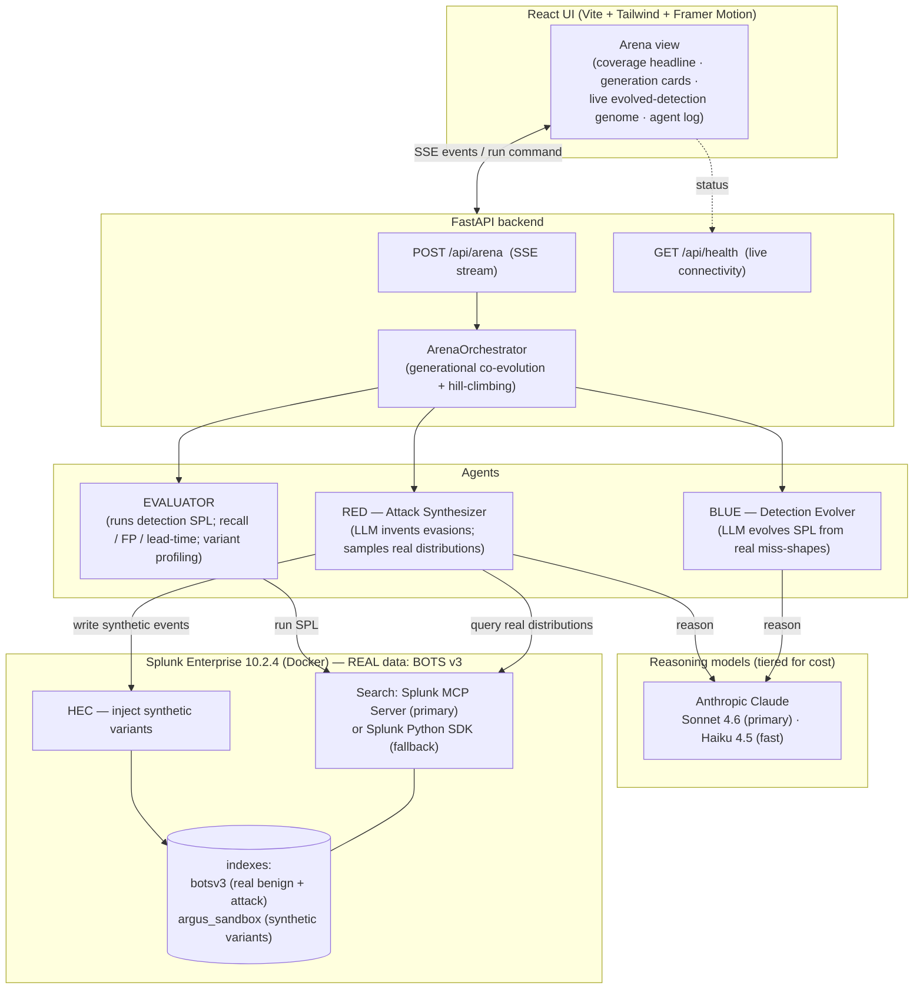
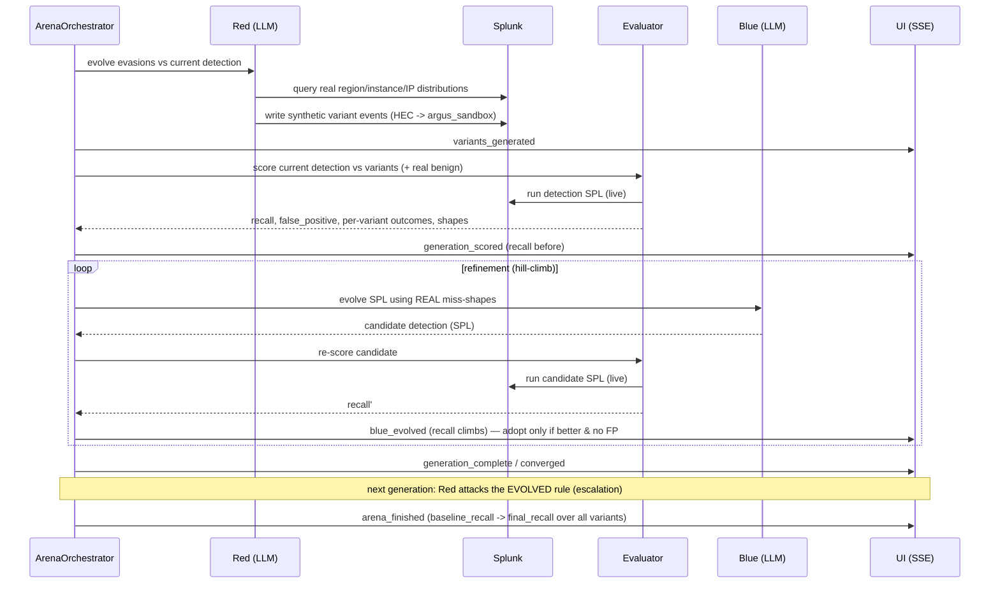

# ARGUS — Architecture Diagram

> Required at repo root by the hackathon rules. Shows how ARGUS interacts with Splunk, how the AI
> agents/models are integrated, and the data flow between services, APIs, and components.
>
> **Design invariant — no hardcoded data:** every value the user sees is computed at runtime from
> real Splunk searches and real model inference. The only synthetic data is the Red agent's attack
> variants, which are *generated live* (sampled from real field distributions) and clearly labeled.
> See the README — *No hardcoded data*.

## What ARGUS is

An **Adversarial Detection Evolution Engine**: an attacker AI (Red) and a defender AI (Blue)
co-evolve inside real Splunk data. Red invents attack variants that evade the current detection;
Blue evolves the detection (SPL) to catch them without firing on benign traffic. Recall is measured
live each round; the result is a hardened detection plus a proven coverage gain.

## System overview

## The co-evolution loop (data flow per generation)

## Components

| Component | Tech | Role |
|---|---|---|
| Frontend | React + TS + Vite + Tailwind + Framer Motion | The Arena: live coverage, generation cards, evolving-rule genome, agent log |
| API | FastAPI + sse-starlette | `/api/arena` (SSE run stream), `/api/health` (real status) |
| Orchestrator | `arena_orchestrator.py` | Generational loop + inner hill-climbing refinement |
| Red | `agents/red_synthesizer.py` | Generates evasive variants; materializes synthetic CloudTrail via HEC |
| Evaluator | `agents/evaluator.py` | Live recall / false-positive / lead-time + per-variant shape profiling |
| Blue | `agents/blue_evolver.py` | Evolves SPL detection calibrated to real miss-shapes |
| Search layer | `splunk/mcp_client.py` (MCP) · `splunk/sdk_client.py` (SDK) | Live SPL execution — never mocked |
| Inject layer | `splunk/hec.py` | Writes synthetic variants into `argus_sandbox` |
| Reasoning | `models/llm.py` (Claude, tiered) | Red/Blue reasoning; not the Splunk data path |
| Data | Splunk + BOTS v3 | Real benign + attack telemetry (`aws:cloudtrail`) |

## Scenario registry & run outputs

The engine is scenario-agnostic: a `Scenario` carries its `sourcetype`, baseline detection,
`distributions()` (live field-pool query) and `build_event()` (synthetic-event builder). `SCENARIOS`
registers them; `/api/scenarios` lists them; the UI selects one. Shipped: **AWS cryptomining** and
**AWS IAM persistence**. Each run emits a **MITRE ATT&CK coverage map** (self-improving), a
**Resilience Certificate** (before/after + SHA-256 fingerprint), and the **residual frontier**
(uncaught evasions) — all computed live.

## How Splunk is used (Splunk-native)

- **Search** runs through the **Splunk MCP Server** (`run_splunk_query`, and `generate_spl` — Splunk's
  own NL→SPL AI) when configured; falls back to the **Splunk Python SDK**. Set via `SEARCH_PROVIDER`.
- **HEC** ingests the Red agent's synthetic variants into a dedicated sandbox index.
- Baseline detection is based on real **Splunk ESCU / Security Content** logic; evolved detections are
  valid SPL deployable as Splunk saved searches.
