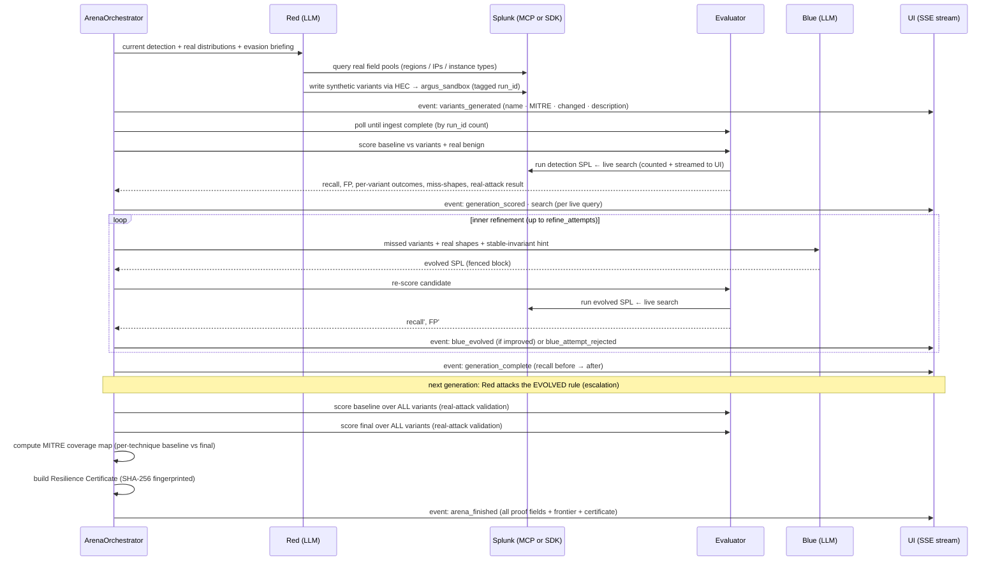

# ARGUS — Architecture Diagram

> **Required at repo root by the hackathon rules.** Shows how ARGUS interacts with Splunk, how the
> AI agents and models are integrated, and the data flow between services, APIs, and components.
>
> **Design invariant — no hardcoded data:** every value the user sees is computed at runtime from
> real Splunk searches. The only synthetic data is the Red agent's attack variants, which are
> *generated at runtime* from real field distributions and clearly labeled `argus_synthetic=true`.

---

## What ARGUS is

An **Adversarial Detection Evolution Engine**: an attacker AI (Red) and a defender AI (Blue)
co-evolve inside real Splunk data. Red invents attack variants that evade the current detection;
Blue evolves the detection (SPL) to catch them without firing on benign traffic. Recall is scored
live each round. The result: a hardened detection, a proven coverage gain, a MITRE ATT&CK coverage
map, and an honest list of remaining blind spots — all computed from live Splunk data.

---

## System overview

```mermaid
flowchart TB
    subgraph UI["React UI (Vite + Tailwind + Framer Motion)"]
        LAND["Landing / Home\n(18-term glossary · 4-step how-it-works · ⓘ on every term)"]
        ARENA["Arena view\n(scenario selector · status header)"]
        PANELS["Arena panels:\n• Coverage headline (0%→X%, FP, real-attack ✓, search count)\n• Judge Proof panel (all measurable facts in one block)\n• Generation cards (per-evasion MITRE · why-missed · changed fields)\n• Baseline→Evolved SPL diff (green added lines + rationale)\n• Approve / Edit / Reject (human-in-the-loop)\n• MITRE coverage map (self-improving bars)\n• Residual frontier (uncaught evasions = blind spots)\n• Resilience Certificate (download + SHA-256 fingerprint)\n• Search activity trace (every live Splunk search streamed)"]
    end

    subgraph API["FastAPI backend (port 8810)"]
        HEALTH["GET /api/health\n(live connectivity — no mock)"]
        SCENARIOS["GET /api/scenarios\n(returns scenario registry)"]
        ARENA_EP["POST /api/arena  → SSE stream\n(streams: search, variants_generated, generation_scored,\n blue_evolved, converged, arena_finished, ...)"]
        APPROVAL["POST /api/approval\n(Approve / Edit / Reject — deploy disabled by default)"]
        ORCH["ArenaOrchestrator\n(generational loop + inner hill-climbing\n run_id · search counter/tracer · ingest poll)"]
    end

    subgraph AGENTS["Agents"]
        RED["RED — Attack Synthesizer\n(LLM proposes evasions targeting the current rule;\n builds synthetic events from real field distributions;\n materializes via HEC; tags argus_synthetic=true + run_id)"]
        EVAL["EVALUATOR\n(live SPL recall · FP on real benign · per-variant shape;\n real-attack validation against BOTS attacker)"]
        BLUE["BLUE — Detection Evolver\n(LLM evolves SPL from real miss-shapes + invariant hints;\n fenced-block SPL; hill-climbing acceptance;\n corrects dotted-field eval quoting)"]
    end

    subgraph MODELS["Reasoning (tiered for cost)"]
        LLM["Anthropic Claude\nSonnet 4.6 (primary) · Haiku 4.5 (fast steps)"]
    end

    subgraph SPLUNK["Splunk Enterprise 10.2.4 (Docker, named volumes) — REAL data: BOTS v3 (1.94M events)"]
        MCP["Splunk MCP Server (app 7931)\ntools: run_splunk_query, generate_spl,\n get_indexes, get_index_info, get_saved_searches"]
        SDK["Splunk Python SDK (fallback)"]
        HEC["HEC (port 8088)\ninjects synthetic variants"]
        IDX[("indexes:\nbotsv3 — real benign + real attack\nargus_sandbox — synthetic variants (per run_id)")]
    end

    LAND <--> ARENA
    ARENA --> PANELS
    PANELS <-->|SSE + commands| ARENA_EP
    PANELS -. status .-> HEALTH
    PANELS -. list .-> SCENARIOS
    PANELS -. decision .-> APPROVAL
    ARENA_EP --> ORCH
    ORCH --> RED & EVAL & BLUE
    RED & BLUE -->|reason| LLM
    RED -->|write synthetic events + run_id| HEC
    RED -->|query real distributions| MCP
    RED -->|query real distributions (fallback)| SDK
    EVAL -->|run detection SPL + score| MCP
    EVAL -->|run detection SPL + score (fallback)| SDK
    HEC --> IDX
    MCP --- IDX
    SDK --- IDX
```

---

## The co-evolution loop (data flow per generation)



---

## Components

| Component | Files | Tech | Role |
|---|---|---|---|
| Frontend shell | `App.tsx` | React + TS | Home/Arena nav, status header (Splunk/AI/Inject), footer |
| Landing page | `views/Landing.tsx` | React | Glossary, 4-step how-it-works, audience — zero-knowledge onboarding |
| Arena UI | `views/Arena.tsx` | React + Framer Motion | All 9 panels (coverage, generations, SPL diff, proof, MITRE, etc.) |
| Design system | `components/ui.tsx` | React | Button, Card, InfoTip (ⓘ), Term — single consistent set |
| Education content | `content.ts` | TS | Single-source glossary (18 terms) + landing copy |
| Stream client | `api/stream.ts` | TS | SSE-over-POST for `/api/arena` |
| API | `backend/api.py` | FastAPI + sse-starlette | `/api/arena` (SSE), `/api/health`, `/api/scenarios`, `/api/approval` |
| Orchestrator | `arena_orchestrator.py` | Python | Generational loop, hill-climbing, run_id, ingest poll, search tracing |
| Red | `agents/red_synthesizer.py` | Python + LLM | Proposes evasions, materializes synthetic events, retries HEC |
| Evaluator | `agents/evaluator.py` | Python | Recall/FP/shape + real-attack validation + variant profiling |
| Blue | `agents/blue_evolver.py` | Python + LLM | Evolves SPL from miss-shapes + invariant hints, fenced-block parsing |
| Scenarios | `scenarios.py` | Python | Registry (cryptomining, IAM); each carries sourcetype + distributions + build_event |
| Search (MCP) | `splunk/mcp_client.py` | Python + `mcp` SDK | Splunk MCP Server client with retry + timeout |
| Search (SDK) | `splunk/sdk_client.py` | Python + splunklib | SDK fallback with retry |
| HEC | `splunk/hec.py` | Python + httpx | Writes synthetic variants to `argus_sandbox`, retry + backoff |
| Reasoning | `models/llm.py` | Python + Anthropic | Claude (tiered): Sonnet primary, Haiku fast — no temperature (rejected by opus-class) |
| Smoke test | `smoke_test.py` | Python | Judge quickstart: Splunk + search + HEC + LLM → ALL PASS or fail per piece |
| Data | Splunk + BOTS v3 | — | 1.94M real `aws:cloudtrail` events (2018–2019); real attack: `web_admin` cryptomining |

---

## Scenario registry & outputs

The engine is **scenario-agnostic**. A `Scenario` carries:
- `sourcetype` and `base_filter` — what events to search
- `baseline_spl` — the starting detection (ESCU-based, raw CloudTrail SPL, uses `{src}` token)
- `benign_scope` — real benign events (for false-positive measurement)
- `real_attack_scope` — the real attacker in BOTS (for real-attack validation)
- `distributions()` — live field-pool query (regions, IPs, instance types)
- `build_event()` — builds one synthetic CloudTrail event from Red's params
- `mitre_names` — technique catalog for the coverage map

`SCENARIOS` registers them; `/api/scenarios` lists them; the UI provides a dropdown to select.

**Shipped scenarios:**

| Key | Technique | MITRE | Baseline weakness |
|---|---|---|---|
| `aws_cryptomining` | Resource Hijacking via valid cloud accounts | T1496 · T1078 · T1535 | Per-username hourly count — misses rate-throttling, IP rotation, multi-region, AssumedRole mimic |
| `aws_iam_persistence` | Persistence via account creation & manipulation | T1136 · T1098 · T1078 | Per-username IAM-change count — misses rotating actors, throttling, service-identity |

**Each run outputs (all computed live):**

| Output | Description |
|---|---|
| **Coverage gain** | Baseline recall % → final recall % across all variants |
| **False-positive result** | Was the evolved rule quiet on real benign autoscaling? |
| **Real-attack validation** | Does the evolved rule catch the genuine BOTS attacker (`web_admin`)? |
| **Per-evasion detail** | MITRE technique · changed fields · why baseline missed · caught/evaded |
| **Blue's rationale** | Plain-English explanation of what Blue changed and why |
| **MITRE coverage map** | Per-technique baseline → final counts (visibly self-improving) |
| **Residual frontier** | Evasions still uncaught = real, prioritized blind spots |
| **Resilience Certificate** | JSON artifact: run_id, scenario, before/after, searches run, SHA-256 fingerprint |
| **MCP/search receipt** | Every live Splunk search: provider, truncated SPL, rows returned |
| **Approval gate** | Approve / Edit / Reject evolved detection (deploy disabled by default) |

---

## How Splunk is used (Splunk-native)

- **Splunk MCP Server (`run_splunk_query`)** — primary search path; every agent SPL runs through it
- **Splunk MCP Server (`generate_spl`)** — Splunk's own AI, called when available
- **HEC (HTTP Event Collector)** — Red's synthetic variants are written to `argus_sandbox`, with retry
- **Splunk Python SDK** — fallback search path when MCP is not configured
- **Baseline detection** — based on real Splunk ESCU / Security Content logic (raw CloudTrail SPL, no CIM add-on needed)
- **Evolved detections** — valid SPL, proposable as Splunk saved searches via the SDK

All searches are **counted and streamed to the UI** (the search-trace panel) so judges can see
Splunk is load-bearing, not decorative. The `_CountingSearch` wrapper in `arena_orchestrator.py`
instruments every search call without changing the provider interface.
