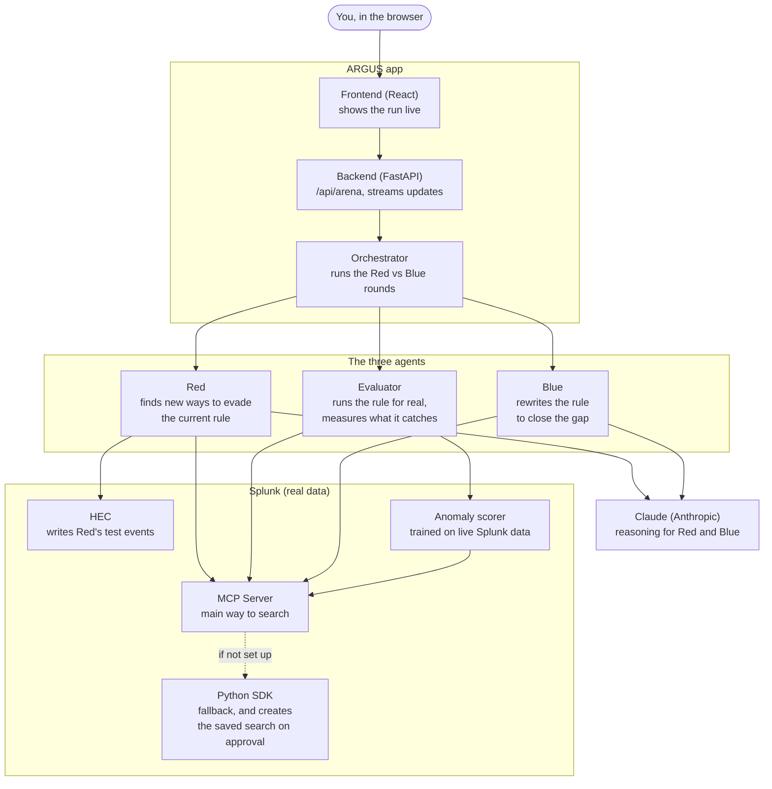

# ARGUS: how it works

ARGUS pits two AI agents against each other inside a real Splunk environment. One agent (Red)
tries to sneak past a security detection rule. The other agent (Blue) rewrites the rule to catch
what got through. They take turns, and every round is checked against real Splunk data, so the
numbers you see at the end (a rule that used to catch 0% of attacks and now catches 100%) are
measured, not made up.

This page explains the system in plain terms: what each piece does, and what actually happens
during one run. For the full technical diagrams (required at the repo root by the hackathon
rules), see [architecture_diagram.md](../architecture_diagram.md). For the reasoning behind the
big design choices, see [the decision records](adr/).

---

## The idea in one paragraph

Security teams write detection rules, for example: "alert if one user creates more than 5 IAM
access keys in an hour." Attackers adapt around rules like this all the time: spread the activity
across more users, slow it down, use different accounts. Most teams never find out their rule has
a gap until an attacker actually walks through it. ARGUS finds that gap automatically, before an
attacker does, by having an AI play the attacker and an AI play the defender, against the same
Splunk data the detection rule already runs on.

---

## Diagram

---

## What each part does

**Frontend (React)**
This is the Arena screen. You pick a scenario and click Run. As the backend works, the screen
updates live: new attack ideas appear, search results stream in, the coverage number climbs.

**Backend (FastAPI)**
One main endpoint, `/api/arena`, runs the whole loop and streams every step back to the browser as
it happens. See [ADR-0004](adr/0004-sse-streaming.md).

**Orchestrator**
The referee. It runs the rounds (called "generations"), keeps track of every attack variant Red
has created, decides whether Blue's new rule is actually better, and builds the final report and
certificate.

**Red (the attacker agent)**
Looks at the current rule and the real data, and invents new ways an attacker could avoid being
caught: spreading actions across more accounts, more IP addresses, more regions, or slowing down.
Red writes these as realistic test events into Splunk, clearly labeled as synthetic.

**Evaluator**
Runs the actual detection rule (a Splunk search) against real and test data, and reports two
things: how many of Red's attacks it caught, and whether it now fires on normal activity that it
shouldn't (a false positive). Nothing here is estimated. It is the result of a real Splunk search.

**Blue (the defender agent)**
Looks at exactly which attacks got through and why, and rewrites the detection rule to catch them.
The new rule is tested by the Evaluator before ARGUS keeps it. If it doesn't catch more, or if it
starts misfiring on normal activity, ARGUS throws the attempt away and Blue tries again. See
[ADR-0001](adr/0001-generational-coevolution.md).

**Claude (Anthropic)**
The language model behind Red and Blue's reasoning. A larger model (Sonnet) handles the actual
attack and rule design; a smaller, faster model (Haiku) handles quick narration steps.

**Splunk**
The real data ARGUS measures everything against (security log data from the public BOTS v3
dataset). ARGUS talks to Splunk two ways: the official Splunk MCP Server is the main path, and the
Splunk Python SDK is the fallback. See [ADR-0002](adr/0002-mcp-primary-sdk-fallback.md). HEC (the
HTTP Event Collector) is how Red's test events get written in.

**Anomaly scorer**
A separate, smaller model that looks at each attack variant and scores how unusual it looks
compared to normal activity. It is trained on real Splunk data every time, and it tries four
different ways of doing this depending on what's available. See
[ADR-0003](adr/0003-four-tier-anomaly-scorer.md).

---

## A real run, step by step

Here is what happens when you pick "AWS IAM Persistence" and click Run. The scenario starts from a
real detection rule that counts how many IAM changes (like creating access keys) each user makes
per hour, and alerts if that count is too high.

1. **The starting rule is tested first.** The Evaluator runs it against the real data. On its own,
   before any attack variants exist, this just confirms the rule works and gives a clean starting
   point.

2. **Generation 1: Red attacks.** Red looks at real patterns in the data (which usernames, IP
   addresses, and regions normally appear) and invents a handful of evasions, for example the same
   activity but spread across several IP addresses instead of one, or using a different kind of
   identity than the rule expects. These get written into Splunk as labeled test events.

3. **The rule is scored against these new attacks.** The Evaluator runs the original rule again,
   now including Red's new variants. Most of them get through, because the rule wasn't written
   with these tricks in mind. This is the "0%" you see at the start.

4. **Blue rewrites the rule.** Blue is shown exactly which variants got through and what made them
   different (which fields changed, how the activity was spread out). Blue proposes a new version
   of the rule, and the Evaluator tests it immediately. If it catches more attacks without
   misfiring on normal activity, ARGUS keeps it. If not, ARGUS keeps the old rule and lets Blue try
   again, up to a few attempts.

5. **Generation 2: Red attacks again, this time against Blue's improved rule.** It has to find a
   new gap, because the old trick no longer works. This is the arms race part: each generation,
   the attacker has to adapt to what the defender just learned.

6. **This repeats for a few generations.** Each one adds more test variants and, usually, a
   stronger rule.

7. **The final scorecard.** At the end, ARGUS takes the very first version of the rule and the very
   last version, and runs both against every attack variant created during the whole run, side by
   side. That comparison is where the headline number comes from.

8. **A reality check.** ARGUS also checks whether the final rule still catches the real, historical
   attack recorded in the BOTS v3 dataset itself, not just the synthetic test variants.

9. **Anything still missed is listed honestly.** If the final rule still misses some variants,
   those are shown as the residual frontier: a ranked list of what's still a gap, each with an
   anomaly score so you know how suspicious it would have looked anyway. See
   [ADR-0005](adr/0005-human-approval-and-honest-reporting.md).

10. **A certificate is produced.** A JSON file recording the before/after numbers, how many live
    Splunk searches were run, which scoring model was used, and a fingerprint (a hash) so the
    result can't be quietly edited afterward.

11. **A human decides what happens next.** You can approve, edit, or reject the new rule. If
    approved, it's created in Splunk as a real saved search, but switched off. Turning it on is a
    separate, deliberate step.

One real run of this scenario went from a starting rule that caught 0% of the test attacks to a
final rule that caught 100%, across 3 generations and 9 attack variants, using 88 live Splunk
searches, with 0 false positives and 0 remaining gaps (certificate `ARGUS-CERT-5882AE74EA`). It
didn't get there in one step: the first improved rule reached 67%, and the next attempt reached
100%. Other runs, or other scenarios, may land somewhere else, and ARGUS reports whatever actually
happened.

---

## Splunk, in detail

Every row below is something ARGUS genuinely uses, not just name-dropped. You can see all of it
happen live in the Arena's search trace panel.

| Splunk feature | What it does in ARGUS | Where you see it |
|---|---|---|
| MCP Server: `splunk_run_query` | Runs every agent's search (Red, Blue, Evaluator, scorer) | Search trace panel, counted live |
| MCP Server: `splunk_get_indexes`, `splunk_get_index_info` | Looks up what data and fields are available | Used when Red builds realistic test events |
| MCP Server: `splunk_get_info` | Confirms the Splunk connection and version | Status header, health check |
| MCP Server: `splunk_run_saved_search` | Confirms the deployed rule really exists in Splunk | "Approve and Deploy" step |
| HEC (HTTP Event Collector) | Writes Red's test events into a separate sandbox index | Tagged `argus_synthetic=true` with a run ID |
| Python SDK | Fallback search path, and creates the real (disabled) saved search on approval | "Approve and Deploy" step |
| Splunk MLTK (`fit` / `apply`) | One of the anomaly scorer's tiers, if MLTK is installed | Anomaly score badges |
| Built-in `anomalydetection` command | The anomaly scorer's default tier, no extra app needed | Anomaly score badges, certificate |
| scikit-learn IsolationForest | Last-resort scorer tier, still trained on live Splunk data | Anomaly score badges |

---

## Why we built it this way

The decisions behind the design are written up as short records:

- [ADR-0001](adr/0001-generational-coevolution.md): Why Red and Blue take turns over several
  rounds, instead of one AI call that rewrites the rule
- [ADR-0002](adr/0002-mcp-primary-sdk-fallback.md): Why the Splunk MCP Server is the main way ARGUS
  talks to Splunk, with the SDK as a fallback
- [ADR-0003](adr/0003-four-tier-anomaly-scorer.md): Why the anomaly scorer tries four different
  approaches, always trained on live Splunk data
- [ADR-0004](adr/0004-sse-streaming.md): Why the run streams live to the screen instead of
  returning one result at the end
- [ADR-0005](adr/0005-human-approval-and-honest-reporting.md): Why nothing deploys without a
  person, and why ARGUS reports what it still can't catch
